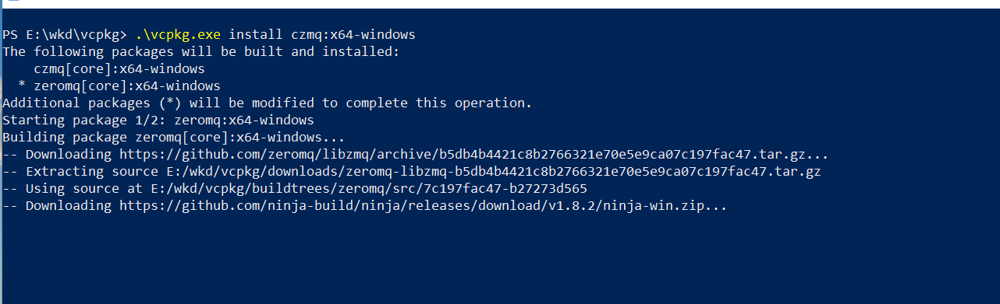

## 安装Czmq库

### 安装准备

Czmq库的安装需要用到vcpkg，下载编译vcpkg前需要安装如下软件：

- Microsoft Visual Studio Professional 2015 （version 14.0.25420.01 Update 3 或更高版本），官方源码站点为：https ://visualstudio.microsoft.com。
- PowerShell （v16.2.1），官方源码站点为：https://github.com/PowerShell/PowerShell/releases。
- 版本控制软件Git（v2.21.0），官方源码站点为：https://github.com/git-for-windows/git/releases。
- Cmake（v3.14.0），官方源码站点为：https://github.com/Kitware/CMake/releases。

注意：由于不同版本的Vcpkg对以上软件版本要求不同，因此需要在操作过程中根据提示下载安装所需版本软件，安装以上软件时 尽量使用默认安装路径。

### 下载Vcpkg

下载Vcpkg，Vcpkg官方源码站点为：http://github.com/microsoft/vcpkg。

编译Vcpkg，打开PowerShell进到vcpkg目录下，执行命令“.\bootstrap-vcpkg.bat”，即可编译。如图2所示。编译好后会在同级目录下生成vcpkg.exe文件，编译期间，脚本会自动下载vswhere组件。

图2 编译Vcpkg

### 下载Czmq库

打开PowerShell进到vcpkg目录下，执行命令“.\vcpkg.exe install czmq:x64-windows”，如果安装32位库，需要执行命令“.\vcpkg.exe install czmq:x86-windows”。如图3所示。下载完成后，在vcpkg目录下的downloads文件夹下会出现下载的压缩文件，在installed文件夹中会出现已经安装的库。

图3 下载Czmq库

### 集成

集成到全局，打开PowerShell进到vcpkg目录下，执行命令“.\vcpkg integrate install”，命令行窗口显示"Applied user-wide integrationfor thiss vcpkg root”则表明集成成功。如图4所示。

图4 vcpkg集成到全局

集成成功后，打开VS2015工程的属性，可以看到，在[Configuration]->[C/C++]->[General]的Additional Include Directories里多了一个“$(VcpkgRoot)include”路径。如图5所示。

图5 vcpkg集后的包含路径变化

打开项目的宏，可以看到，与Vcpkg相关的宏定义。如图6所示。

图6 vcpkg集后的项目的宏变化

当vcpkg集成到VS2015以后，所有的C++项目都可以引用vcpkg的头文件，只需要在工程中包含需要引用的头文件即可。